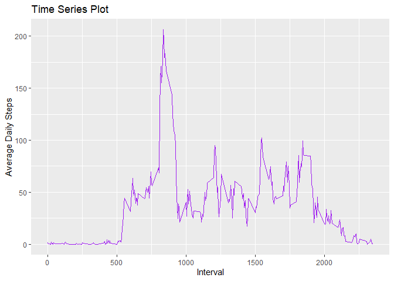
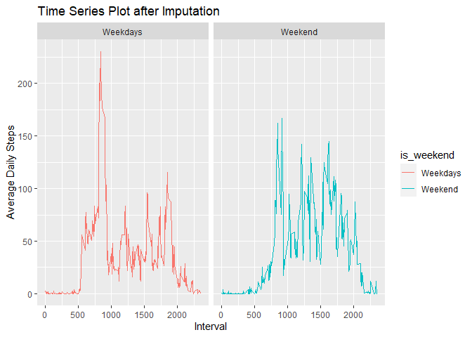

## Loading and preprocessing the data  
The first step is to unzip the given file "activity.zip"

```r
unzip("activity.zip")
```

Then it is read into R and its contents examined

```r
dat <- read.csv("activity.csv")
head(dat)
```

```
##   steps       date interval
## 1    NA 2012-10-01        0
## 2    NA 2012-10-01        5
## 3    NA 2012-10-01       10
## 4    NA 2012-10-01       15
## 5    NA 2012-10-01       20
## 6    NA 2012-10-01       25
```

```r
tail(dat)
```

```
##       steps       date interval
## 17563    NA 2012-11-30     2330
## 17564    NA 2012-11-30     2335
## 17565    NA 2012-11-30     2340
## 17566    NA 2012-11-30     2345
## 17567    NA 2012-11-30     2350
## 17568    NA 2012-11-30     2355
```

```r
dim(dat)
```

```
## [1] 17568     3
```

**Data Processing**  
Below is the steps taken to prepare the data for the assignment

```r
library(lubridate)
```

```
## 
## Attaching package: 'lubridate'
```

```
## The following objects are masked from 'package:base':
## 
##     date, intersect, setdiff, union
```

```r
library(tidyverse)
```

```
## -- Attaching packages ------------------------------------------------- tidyverse 1.3.0 --
```

```
## v ggplot2 3.3.2     v purrr   0.3.4
## v tibble  3.0.3     v dplyr   1.0.1
## v tidyr   1.1.1     v stringr 1.4.0
## v readr   1.3.1     v forcats 0.5.0
```

```
## -- Conflicts ---------------------------------------------------- tidyverse_conflicts() --
## x lubridate::as.difftime() masks base::as.difftime()
## x lubridate::date()        masks base::date()
## x dplyr::filter()          masks stats::filter()
## x lubridate::intersect()   masks base::intersect()
## x dplyr::lag()             masks stats::lag()
## x lubridate::setdiff()     masks base::setdiff()
## x lubridate::union()       masks base::union()
```

```r
dat$date <- ymd(dat$date)
dat1 <- dat %>%
        filter(!is.na(steps)) %>%
        group_by(date) %>%
        mutate(total_steps = sum(steps))
histo <- data.frame(date=unique(dat1$date), total_steps=unique(dat1$total_steps))
```

**Plotting**  
The following histogram shows the frequency distribution of the daily total steps

```r
ggplot(data = histo) +
        geom_histogram(aes(total_steps), binwidth = 600,
                       color = "black", fill = "sky blue") +
        xlab("Daily Total Steps") +
        ylab("Frequency")
```

<!-- -->


## What is mean total number of steps taken per day?  
**Calculating "mean" and "median"**  
The mean and median of the total numbers of steps taken per days are calculated below

```r
cat("Mean is", mean(histo$total_steps))
```

```
## Mean is 10766.19
```

```r
cat("Median is", median(histo$total_steps))
```

```
## Median is 10765
```


## What is the average daily activity pattern?
**Time Series Plot**  

```r
daily <- dat1 %>%
        ungroup %>%
        group_by(interval) %>%
        mutate(interval_mean = mean(steps)) %>%
        arrange(desc(interval_mean))
ggplot(daily, aes(interval, interval_mean)) +
        geom_line(color = "Purple") +
        labs(x = "Interval", y = "Average Daily Steps") +
        ggtitle("Time Series Plot")
```

<!-- -->

**The 5-minute interval which contains the maximum number of steps is**

```r
cat("The 5-minute interval with maximum steps is", daily$interval[1])
```

```
## The 5-minute interval with maximum steps is 835
```


## Imputing missing values
**Imputation of missing values are done by mean of th interval across all days**

```r
cat("The total number of missing value is,", sum(is.na(dat)))
```

```
## The total number of missing value is, 2304
```

```r
dat2 <- dat %>%
        group_by(interval) %>%
        mutate(interval_mean = mean(steps, na.rm = TRUE))
imputed <- data.frame(sapply(dat2,
                             function(x) ifelse(is.na(x),
                                                dat2$interval_mean, x)))
imputed$steps <- as.double(imputed$steps)
imputed$date <- as.POSIXlt.Date(imputed$date)
imputed$interval_mean <- as.double(imputed$interval_mean)

head(imputed)
```

```
##       steps       date interval interval_mean
## 1 1.7169811 2012-10-01        0     1.7169811
## 2 0.3396226 2012-10-01        5     0.3396226
## 3 0.1320755 2012-10-01       10     0.1320755
## 4 0.1509434 2012-10-01       15     0.1509434
## 5 0.0754717 2012-10-01       20     0.0754717
## 6 2.0943396 2012-10-01       25     2.0943396
```

```r
tail(imputed)
```

```
##           steps       date interval interval_mean
## 17563 2.6037736 2012-11-30     2330     2.6037736
## 17564 4.6981132 2012-11-30     2335     4.6981132
## 17565 3.3018868 2012-11-30     2340     3.3018868
## 17566 0.6415094 2012-11-30     2345     0.6415094
## 17567 0.2264151 2012-11-30     2350     0.2264151
## 17568 1.0754717 2012-11-30     2355     1.0754717
```

```r
dim(imputed)
```

```
## [1] 17568     4
```

**Histogram from Imputed Data frame**

```r
imputed$date <- ymd(imputed$date)

dat3 <- imputed %>%
  group_by(date) %>%
  mutate(total_steps = sum(steps))

histo_imputed <- dat3[!duplicated(dat3$date),]

ggplot(data = histo_imputed) +
        geom_histogram(aes(total_steps), binwidth = 600,
                       color = "black", fill = "sky blue") +
        xlab("Daily Total Steps") +
        ylab("Frequency")
```

<!-- -->

```r
cat("Mean after imputation is", mean(dat3$total_steps))
```

```
## Mean after imputation is 10766.19
```

```r
cat("Median after imputation is", median(dat3$total_steps))
```

```
## Median after imputation is 10766.19
```

After imputation, median and mean became equal.  


## Are there differences in activity patterns between weekdays and weekends?

```r
week_days <- dat3 %>%
  ungroup() %>%
  mutate(is_weekend = ifelse((weekdays(date)=="Saturday" | weekdays(date)=="Sunday"),
                             "Weekend", "Weekdays"))
week_days$is_weekend <- as.factor(week_days$is_weekend)
dat4 <- week_days %>%
  group_by(interval, is_weekend) %>%
  mutate(interval_mean = mean(steps))

ggplot(dat4, aes(interval, interval_mean, color = is_weekend)) +
  geom_line() +
        labs(x = "Interval", y = "Average Daily Steps") +
        ggtitle("Time Series Plot after Imputation") +
  facet_wrap(. ~ is_weekend)
```

<!-- -->

